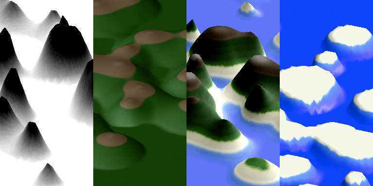
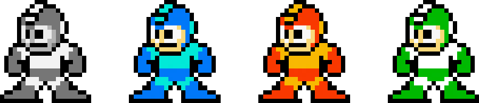
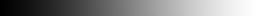
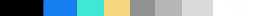
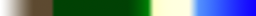

#The Procedural Generation of Form

> Q: Can the computer substitute for the Designer?  
> A: Probably, in some special cases, but usually the computer is an aid to the Designer.
> <cite>— Charles Eames, Design Q&A ([Transcript](http://markwunsch.com/blog/2008/09/27/design-q-a-with-charles-eames.html))</cite>

Computer programming is a powerful tool for creating and manipulating form. Software sound synthesizers have been used since the 1970's. Digital photo processing has all but completely replaced traditional photo retouching. Entire film sets are routinely created digitally. Generative 3D models can be fabricated with consumer 3D printers. In most cases, when a computer is used to create form, general purpose applications are used to combine and manipulate scanned images, recorded sounds, manually created 3D models, and other assets.

It is also possible to create form entirely from code. There are many techniques in generative art, some of the most well known include: fractals, [recursion](http://recursivedrawing.com/), l-systems, Markov-chains, cellular automata, and Perlin noise.

In this presentation I will discuss and demonstrate a few techniques for building **complex**, **controlled**, and **deterministic** forms with code. Along the way I will briefly introduce a variety of technologies and libraries. These techniques will be used together to create an application that procedurally generates a virtual island:

Some goals for this application:

- **Variety** It should be able to create an interesting range of appearances.
- **Visually Complex** Output should look natural, without mechanical repetitions.
- **Controlled** It should accept parameters to customize output.
- **Deterministic** Given the same input, should produce identical, predictable output.
- **Code Driven** It should use a minimum of external assets.

The application uses a variety of technologies and libraries:

- **HTML5 Canvas** HTML Element that allows drawing with JavaScript [Docs](https://developer.mozilla.org/en-US/docs/HTML/Canvas)
- **WebGL** 3D (and 2D) graphics with JavaScript [Docs](https://developer.mozilla.org/en-US/docs/Web/WebGL)
- **jQuery** A leading JavaScript library that makes working with webpage content easier [Docs](http://jquery.com/)
- **Three JS** A JavaScript library that makes working with WebGL easier [Docs](http://threejs.org/)
- **CoffeeScript** A programming language that compiles into JavaScript [Docs](http://coffeescript.org/)

##Additive Synthesis: Combining Simple Patterns Gives Rise to Complex Patterns

Computers are digital. Within a computer **everything** is represented by numbers. When you scan an image, the scanner creates a sequence of numbers that describe the image. This works backwards as well; you can generate a sequence of numbers and display it as an image. Sequences of numbers can represent just about anything: the audio samples in a sound, the location of vertices in a 3D model, the layout of a level a videogame. **To create form with a program we need to generate interesting sequences of numbers.**

Audio syntheizers often use [Addative Synthesis](http://en.wikipedia.org/wiki/Additive_synthesis)to create different timbres. If you add enough simple sine waves together, any arbitrary periodic signal can be <a href="http://en.wikipedia.org/wiki/Fourier_series">closely reproduced</a>. 

This basic concept—adding simple patterns together to make complex patterns—can used in many ways. The demo below shows three sine waves of different periods and amplitudes in gray and their sum in red. Notice that though the sine waves repeat frequently, the period of the sum wave is much longer. The sum wave does eventually repeat; its period will be the least common multiple of the periods of the sine waves.

<a class="view-code" href="lab.html?scripts/additive.coffee">View Code</a>

##Shaping: Bend The Numbers to Your Will

We have seen that complex patterns of numbers can be created by adding simple patterns together. Sometimes it is helpful to post-process the resulting values to achieve specific effects. The demo below shows three sequences of numbers: a sine wave, a saw wave, and the sum of sines from the first demo. By mathematically manipulating each number in the sequences we can shape them.

<a class="view-code" href="lab.html?scripts/shaping.coffee">View Code</a>

- **Pre-Gain** multiplies each number by a constant factor.
- **Bais** adds a set amount to the values.
- **Exponent** raises the number to a power. Powers above 1 sharpen peaks, powers below one round them off.
- **Min** clamps low values to minimum allowed value.
- **Max** clamps high values to maximum allowed value.
- **Post-Gain** multiplies each number by a constant factor, again.
- **Absolute Value** makes all negative values positive.

The next demo allows you to directly enter a mathematical expression to generate a series of numbers and process them:

<a class="view-code" href="lab.html?scripts/shaping_two.coffee">View Code</a>

##On an Empty Field a Single Blue Dot: Introducing Three JS

WebGL is a JavaScript API for creating 3D graphic applications that run in the [browser](http://caniuse.com/#search=webgl). WebGL allows you to create 2D and 3D graphics that are rendered by very quickly by specialized 3D hardware.

Three.js is a library that makes working with WebGL easier, by packaging up some common requirements. It was created by [mrdoob](http://www.mrdoob.com/) and has been contributed to by 270+ people on [github](https://github.com/mrdoob/three.js). It is still in development, documentation is incomplete, but there it has a fairly active community and numerous examples are available.

The Demo below shows how to setup, render, and animate a basic scene.

<a class="view-code" href="lab.html?scripts/setup_threejs.coffee">View Code</a>

##Morié Patterns: Emergence in Two-dimensional Patterns

Combining simple patterns to create complex ones works with two-dimensional patterns as well. A common example is a [Morie Pattern](http://en.wikipedia.org/wiki/Moir%C3%A9_pattern), a pattern that emerges when two similar patterns are overlaid with a slight shift in scale or rotation. Like the one-dimensional examples above, the resulting pattern is more complicated and repeats less frequently.

The demo above draws two patterns of dots. When zoomed out you can see the Morie Patterns clearly. Up close, the underlying patterns can become lost.

<a class="view-code" href="lab.html?scripts/morie.coffee">View Code</a>

- **A** adjusts the rotation and scale of one of the layers.
- **Zoom** will scale the overall scene.
- **Material** controls how the material used to draw and combine the patterns.

The first demos created a set of numbers using a purely mathematical approach. This demo constructs an image by drawing circles following a specific procedure. The image can be considered as a set of numbers. Each pixel in the image is represented by three numbers ranging from 0 to 255. These numbers are interpreted as the red level, green level, and blue level when the image is drawn. We could interpret these numbers differently though. In the next demo we will do just that.

##Color Ramps and Palette Swaps 

Grayscale images can be colorized by assigning a specific color to each grayscale shade. This technique was common on 8 and 16 bit video game systems where resources were tight. Saving a single grayscale value for each pixel takes less memory than storing values for red, green, and blue. Even more dramatic savings were found by using different palettes to colorize the same sprites, creating variety.

- [Color Ramp Builder](http://www.pixelfor.me/crc/)

In the very early days of video games, the processor was not powerful enough to update a whole rastor-based screen for every frame of animation. Care had to be taken to make sure that only the pixels that changed between frames were touched. Full screen animation was impossible, almost. A technique called color cycling, or palette rotation, allowed for animation effects without actually changing the stored values in the rastor data _at all_. Instead, the pallete used to color the data—much less data—was changed frame to frame.

- [Palette Rotation/Color Cycling Example](http://www.effectgames.com/demos/canvascycle/)

##And The Islands Rise

The next demo combines the the previous techniques (and some new ones) to create the 3D island. This demo is more complex than the previous ones. Lets break it down:

###Generate
The program begins by drawing three grids of blurry dots. The grids are multiplied together like in the Moire demo.

###Filter
The program then filters the image by applying a function to the color values of each pixel. The function is basically the same as the one used to bend the waves above.

###Interpret
The program then interprets the gray scale values of the image. Instead of considering the values as the Red, Green, and Blue values to display, the program uses the brightness to look up a color in table. This works like a color-by-number. The 3D view also uses the brightness of the pixel. This time it determines the height of the island at each point.

<a class="view-code" href="lab.html?scripts/islands.coffee">View Code</a>

