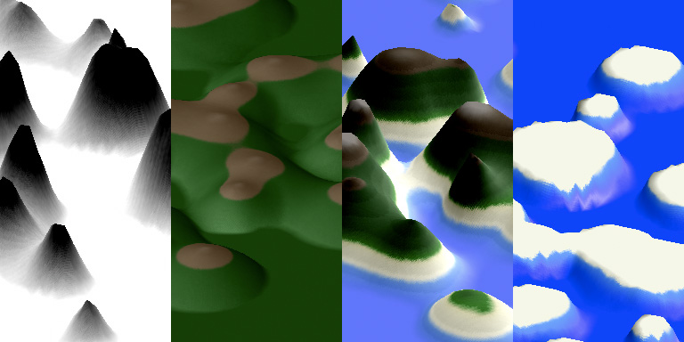

> Q: Can the computer substitute for the Designer?  
> A: Probably, in some special cases, but usually the computer is an aid to the Designer.
> <cite>— Charles Eames, Design Q&A ([Transcript](http://markwunsch.com/blog/2008/09/27/design-q-a-with-charles-eames.html))</cite>

Computer programming is a powerful tool for creating and manipulating form. Software sound synthesizers have been used since the 1970's. Digital photo processing has all but completely replaced traditional photo retouching. Entire film sets are routinely created digitally. Generative 3D models can be fabricated with consumer 3D printers. In most cases, when a computer is used to create form, general purpose applications are used to combine and manipulate scanned images, recorded sounds, manually created 3D models, and other assets.

It is also possible to create form entirely from code. There are many techniques in generative art, some of the most well known include: fractals, [recursion](http://recursivedrawing.com/), l-systems, Markov-chains, cellular automata, and Perlin noise.

In this presentation I will discuss and demonstrate a few techniques for building **complex**, **controlled**, and **deterministic** forms with code. Along the way I will briefly introduce a variety of technologies and libraries. These techniques will be used together to create an application that procedurally generates a virtual island:

Some goals for this application:

- **Variety** It should be able to create an interesting range of appearances.
- **Visually Complex** Output should look natural, without mechanical repetitions.
- **Controlled** It should accept parameters to customize output.
- **Deterministic** Given the same input, should produce identical, predictable output.
- **Code Driven** It should use a minimum of external assets.

The application uses a variety of technologies and libraries:

- **HTML5 Canvas** HTML Element that allows drawing with JavaScript [Docs](https://developer.mozilla.org/en-US/docs/HTML/Canvas)
- **WebGL** 3D (and 2D) graphics with JavaScript [Docs](https://developer.mozilla.org/en-US/docs/Web/WebGL)
- **jQuery** A leading JavaScript library that makes working with webpage content easier [Docs](http://jquery.com/)
- **Three JS** A JavaScript library that makes working with WebGL easier [Docs](http://threejs.org/)
- **CoffeeScript** A programming language that compiles into JavaScript [Docs](http://coffeescript.org/)

    <button id="setup-demo-button-animate">Animate</button>

